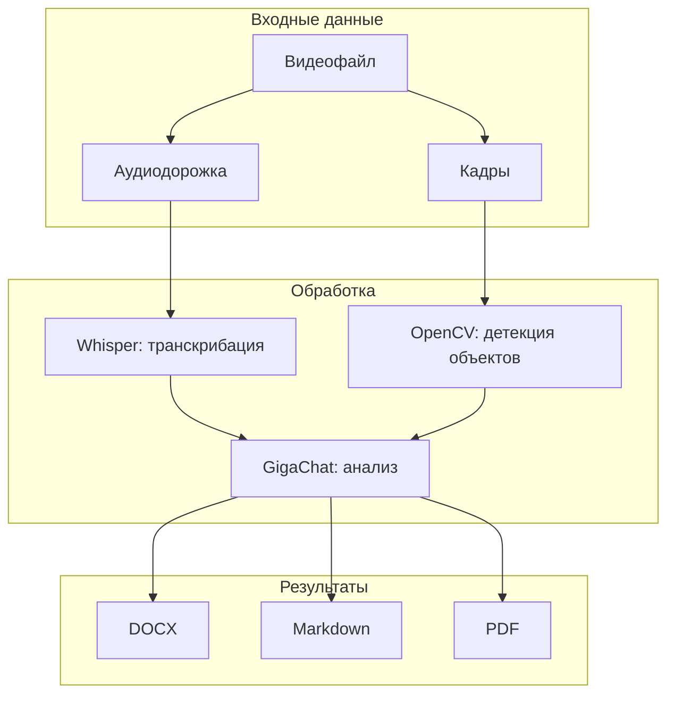

# 🎓 Генератор лекций по видео | AI Hackathon MIPT 2025

**Автоматизированное создание структурированных лекций** из видео материалов с поддержкой экспорта в DOCX/MD/PDF

## 🌟 Основные возможности

| Функция | Описание |
|---------|----------|
| 🎥 **Видео-анализ** | Автоматическая обработка загруженных видеофайлов |
| ✍️ **Умное конспектирование** | Генерация структурированного конспекта с разделами и примерами |
| 🧠 **GigaChat (Сбер)** | Использование продвинутой AI-модели для обработки |
| 📂 **Мультиформатный экспорт** | Скачивание результатов в DOCX и PDF |
| 🖥️ **Удобный интерфейс** | Веб-доступ через Flask |

## 🛠️ Технологический стек

## 🚀 Быстрый старт

### Установка зависимостей
```bash
pip install -r requirements.txt
```
### Установка  Docker
```bash
sudo apt-get update && \
sudo apt-get install docker-compose -y && \
sudo usermod -aG docker $USER && \
newgrp docker && \
sudo systemctl restart docker
```
### Запуск в WSL2 
```shell
docker-compose down && docker-compose up --build
```
После запуска откройте в браузере:  
👉 [http://localhost:8501/](http://localhost:8501/)

## 📂 Получаемые файлы

После обработки будут доступны для скачивания:
- `summary.docx` - Документ Word с форматированием
- `summary.md` - Документ Markdown с форматированием
- `summary.pdf` - PDF версия лекции

## 🎯 Производительность

| Компонент          | Время обработки  |
|--------------------|------------------|
| Аудио (Whisper)    | ~1 минута        |
| Видео (OpenCV)     | ~30 секунд       |
| AI-анализ (GigaChat)| ~20 минут       |

## Оптимизации:
- Whisper: включен fp16 режим
- OpenCV: batch-обработка кадров
- GigaChat: кеширование запросов

## 📌 Пример использования

1. Загрузите видеофайл через интерфейс
2. Дождитесь обработки (прогресс отобразится в реальном времени)
3. Скачайте готовую лекцию в нужном формате

## 📜 Лицензия
Этот проект распространяется под лицензией MIT.

---

<div align="center">
  <p>Разработано для AI Hackathon MIPT 2025</p>
  <p>© 2025 Команда разработчиков Рейнджеры</p>
</div>


